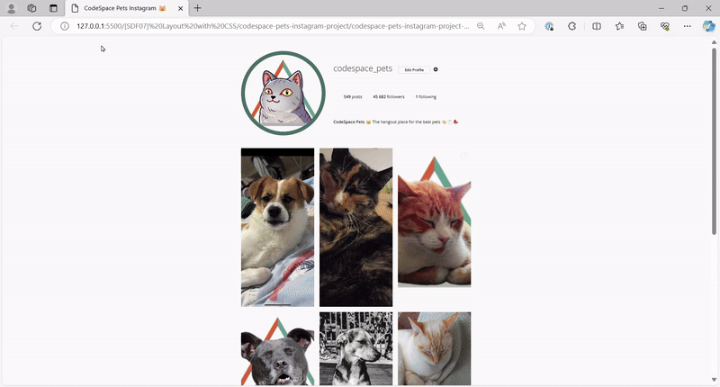

# [SDF03] CS Pets Instagram Profile 📸

Welcome to your **CSS Layout Challenge!** This project is all about applying **CSS styling and layout techniques** to build a **visually engaging Instagram-style profile page** for CodeSpace Pets.  

## 🎨 Project Preview  

Check out what your final project should look like:  

  

## 📖 Challenge Brief  

All project instructions, requirements, and submission details can be found in the **challenge brief**.  
Make sure to read it carefully before you start:  

🔗 You will find the Challenge Brief in this repo in a markdown file called `CHALLENGE-BRIEF.MD`

https://www.w3schools.com/
https://www.youtube.com/watch?v=1PnVor36_40&t=525s
https://coderstar.in › projects › instagram-clone-using-html-css-js.html all the webites that helped in completing the project

